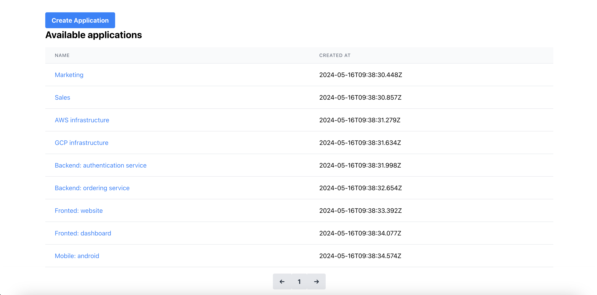

# Applications Metrics 

A system that enables users to post and visualize metrics to specific applications

## Table of Contents

- [Requirments](#requirments)
- [Screenshots](#screenshots)
- [Installation](#installation)
- [Technical design](#technical-design)

## Requirments

- Users should be allowed to create `application`, each application should be holding `metrics`
- Users should be able to list the available `applications` paginated.
- Users should be able to create `metrics` for an `application`. Each metric should have:
    - `name` a string value
    - `value` a umeric value
    - `timestamp` a datetime 
- Users should be able to list the created `metrics` for specific `application`. In the list view, the users should be able to see these aggregations:
    - AVG
    - p99
    - p95
    - p50 (median)
- Users should be able to see the `metric` detailed aggregations grouped by these durations:
    - minute
    - hour
    - day
    - week
    - month
    - quarter
    - year

## Screenshots
- List applications view

- Create application modal

- Application metrics list with stats

- Single application metric timeline

- Create application metric datapoint


## Installation
The repo has 3 folders:
- `metrics-api`. A rails 7 app that has all the backend logic
- `metrics-spa`. A singe page app written in react.
- `metrics-api-clients`. Auto generated clients derived form the openapi specs defined by the rails app. Check the folder readme for more info

In order to start the backend and the frontend, in the `metrics-api` run;
```
$ docker-compose up -d
```
The frontend app runs at port 3001, and rails app is running at port 3000

In order to run linter:
```
$ docker-compose exec web bundle exec rubocop
```
In order to run specs:
```
$ docker-compose exec web bundle exec rspec
```
In order to run DB seeder:
```
$ docker-compose exec web bundle exec rake db:seed
```

### Backend technologies
- Rails 7 app that uses these services:
    - Postgres
    - Redis
    - Sidekiq
    - Opensearch
    - Fully docerized + docker compose file that includes all required services.
    - The service is using rubocop to enforce coding styling.
- Full test coverage written using rspec.
- Functionalities divided by service objects.
- All endpoints documents in `openapi.yml` file.

### Frontend technologies
- A single page app written in TS.
- The app is generated by create-react-app.
- API layer is using axios.
- Tailwind is being used for styling.

## Technical design

### Database diagram


### Flows
#### Create application

#### List applications

#### List application metrics

#### Show application metric timeline

#### Create application metric datapoints

